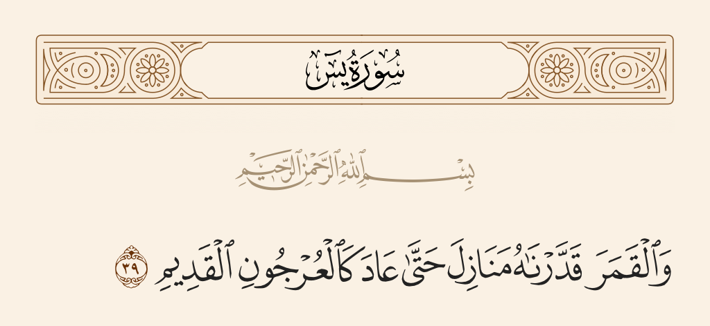

# 🇲🇦 Manazel Project ____ مشروع منازل

The **Manazel Project** aims to accurately determine the beginning of each Hijri month in Morocco 🇲🇦 by analyzing 13 years of crescent visibility data and tuning the ODEH criterion using **ARCV** and **W_tot** features. This approach, combined with logistic regression learning model, achieves **98.83% accuracy** in predicting the start of the Hijri month.


## ODEH Criterion in Morocco - Distribution of Moroccan Crescent Visibility Announcements.


- According to the ODEH criterion, Moroccan authorities have performed remarkably well in crescent sighting over the last 13 years. The majority of announcements were predicted **A** and **B**, which aligns with Morocco’s practice of **naked-eye crescent visibility** for determining the Hijri calendar.
- However, there is a notable limitation: when ODEH classifies the crescent visibility as **B**, it becomes harder to predict whether the crescent will actually be seen. Despite this, the plot shows that **A** classifications have the highest probability of confirmed visibility, followed by **B**.
- Motivated by these observations, we conducted a deeper analysis of Moroccan crescent visibility over the past 13 years and trained a machine learning model that **tunes the ODEH criterion** based on **ARCV** and **W_tot** features.

## Astronomical Parameters and Visibility Criteria

The new criterion proposed by Mohammad Odeh is based on two key astronomical parameters ([Read the article](https://www.researchgate.net/publication/225099773_New_Criterion_for_Lunar_Crescent_Visibility)):

### ARCV (Arc of Vision)
- **Definition:**  
  ARCV is the angular difference in altitude between the Moon and the Sun. It quantifies how high the Moon is above the horizon relative to the Sun at the time of observation.
- **Significance:**  
  A higher ARCV reduces the atmospheric extinction (dimming) of the crescent, thereby increasing its apparent brightness and improving the likelihood of naked-eye visibility.

### W_tot (Topocentric Crescent Width)
- **Definition:**  
  W_tot measures the width of the illuminated portion of the lunar crescent along its diameter, expressed in arc minutes.
- **Significance:**  
  This parameter serves as a reliable indicator of the intrinsic brightness of the crescent.

### Visibility Codes Determination

Odeh’s study compiled 737 historical observations and derived a visibility prediction equation that combines ARCV and W_tot:

$$
V = \text{ARCV} - \left(-0.1018\, W^3 + 0.7319\, W^2 - 6.3226\, W + 7.1651\right)
$$

Based on the computed value \( V \), the crescent visibility is classified into the following zones:

- **Zone A (V ≥ 5.65):**  
  The crescent is visible by the naked eye.
- **Zone B (2 ≤ V < 5.65):**  
  The crescent is visible with optical aid and may also be seen by the naked eye.
- **Zone C (–0.96 ≤ V < 2):**  
  The crescent is visible only with optical aid.
- **Zone D (V < –0.96):**  
  The crescent is not visible even with optical aid.

These thresholds were empirically determined from observational data.
Manazel project tries to tune the equation of V using machine learning based on Moroccan data.

## Data Preparation
We explored the official website of the [Moroccan Ministry of Awqaf](https://www.habous.gov.ma/%D9%85%D8%B1%D8%A7%D9%82%D8%A8%D8%A9-%D8%A7%D9%84%D8%A3%D9%87%D9%84%D8%A9-4) to track and record the beginning of each Hijri month.

For each confirmed sighting of the crescent (*Hilal*), we calculated the **W_tot** and **ARCV** values of the **preceding day**, labeling it as **1 (seen)**.

To construct a dataset for cases where the crescent was **not seen**, we identified months that completed 30 days (i.e., when no crescent was observed on the 29th night), and we went **two days back** to log those observations as **0 (not seen)**.

This method allowed us to compile a balanced and meaningful dataset, which was then used to train our machine learning model for crescent visibility prediction.

## Model Performance

Below is the grid search with cross validation report for our **logistic regression** model, demonstrating **98.83% accuracy** :

```
Logistic Regression:
  Best Params: {'C': 100, 'solver': 'lbfgs'}
  Overall CV Accuracy: 0.9883
```

## Explanation of the Algorithm

1. **Initial Gregorian Conversion:**
   - Set the day to `1` and convert the Hijri date (year, month, day) to a Gregorian date. This transformation sets in default the hijri month duration to 29 days.
   - This Gregorian date is used as a baseline for further calculations.

2. **Iterative Hilal Visibility Check:**
   - Begin with an offset of `-1` day to check the day before the converted Gregorian date.
   - For each iteration:
     - Calculate the "doubt night" by adding the current offset to the base Gregorian date.
     - Compute the necessary astronomical parameters (e.g., ARCV, W_topo) for a fixed location (Rabat).
     - Use these parameters as input for a predictive model that checks if the hilal is visible (model returns `1` if visible).
     - Increase the day offset and iteration counter.
     - The loop continues until the model confirms hilal visibility or a set maximum number of iterations is reached.

3. **Determining the First Day of the Month:**
   - Once the hilal is detected (model outputs `1`), the first day of the Hijri month is determined by taking the next day after the "doubt night."

4. **Error Handling:**
   - If the maximum iteration limit is reached without detecting the hilal, the algorithm raises a runtime error, ensuring that it does not loop indefinitely.

This method ensures that the Gregorian date returned accurately reflects the first day of the Hijri month based on actual crescent visibility conditions in Morocco.

## Acknowledgements:
The Manazel project is based on the incredible work https://github.com/crescent-moon-visibility/crescent-moon-visibility and https://github.com/cosinekitty/astronomy/tree/master/source/python 

This project would not have been possible without the dedication of Chaymae Majdoubi, who gathered and curated the crescent visibility dataset of Morocco over the past 13 years.

## Contributions
We welcome contributions from the community!

## Final Remark
Do not forget us from your douaa.